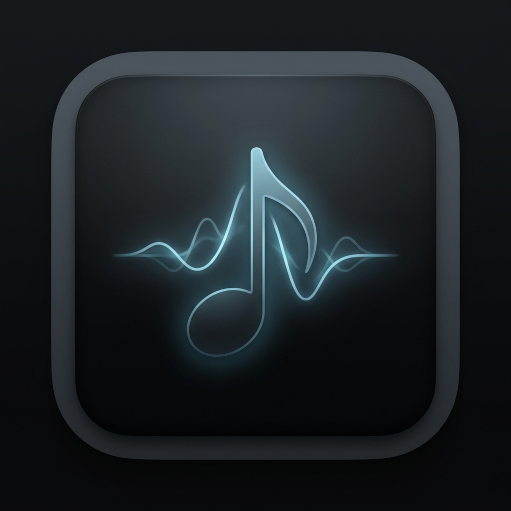
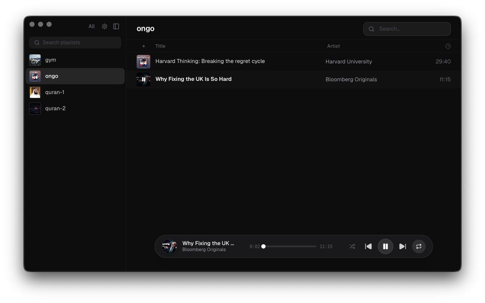

<div align="center">
  
  <h1>Molly</h1>
  <p>A sleek, native-feeling desktop audio player built with modern web technologies.</p>

  <p>
    <a href="https://react.dev">React</a> •
    <a href="https://electronjs.org">Electron</a> •
    <a href="https://vitejs.dev">Vite</a> •
    <a href="https://tailwindcss.com">Tailwind CSS</a>
  </p>
</div>

<br />

<div align="center">
  
</div>

<br />

## ✨ Features

- 🎨 **Beautiful UI:** A sleek, premium dark-mode interface inspired by modern macOS design principles.
- ⚡️ **Blazing Fast:** Built on Vite and optimized React for snappy interactions and fast loading times.
- 📁 **Smart Folder Sync:** Just point Molly to your music directory, and it will automatically monitor for changes, mapping subfolders to discrete playlists.
- 💿 **ID3 Tag Parsing:** Automatically extracts metadata like Title, Artist, Album, and Cover Art from your audio files.
- 🎛️ **Full Playback Controls:** Seamless shuffle, repeat (one or all), and precise seeking with a native-feeling progress bar.
- 🔍 **Instant Search:** Quickly filter and find the perfect track within your library or active playlist.
- 💻 **Cross-Platform:** Works on macOS (Intel & Apple Silicon) and Windows.

## 🚀 Getting Started

### Prerequisites

- Node.js 18+
- npm or yarn

### Installation

1. Clone the repository:
   ```bash
   git clone https://github.com/yousseftarek/molly.git
   cd molly
   ```

2. Install dependencies:
   ```bash
   npm install
   ```

3. Run the development server:
   ```bash
   npm run dev
   ```

### Building for Production

**macOS (Intel & Apple Silicon):**
```bash
npm run build:mac
```

**macOS (Apple Silicon specifically):**
```bash
npm run build:mac:arm
```

**Windows:**
```bash
npm run build:win
```

## 🛠️ How It Works

Molly leverages **Electron** for native desktop integration and a **React** + **Vite** frontend for a lightning-fast UI.

1. **Local Library Import:** When you select a directory, the Electron main process uses `chokidar` to recursively scan and watch for audio files (`.mp3`, `.wav`, `.m4a`, etc.).
2. **Auto-Playlists:** The app automatically organizes your tracks by flattening the directory structure. For example, a file at `Ambient/Deep Space/Event Horizon.mp3` is parsed into the "Deep Space" playlist.
3. **Metadata Extraction:** The `music-metadata` library reads ID3 tags directly from the files, displaying embedded cover art seamlessly via a custom `id3-cover://` protocol.
4. **Optimized Build:** Frontend dependencies are strictly managed in `devDependencies` to ensure the final `.asar` package remains incredibly small and performant.

## 📝 License

This project is licensed under the MIT License.
